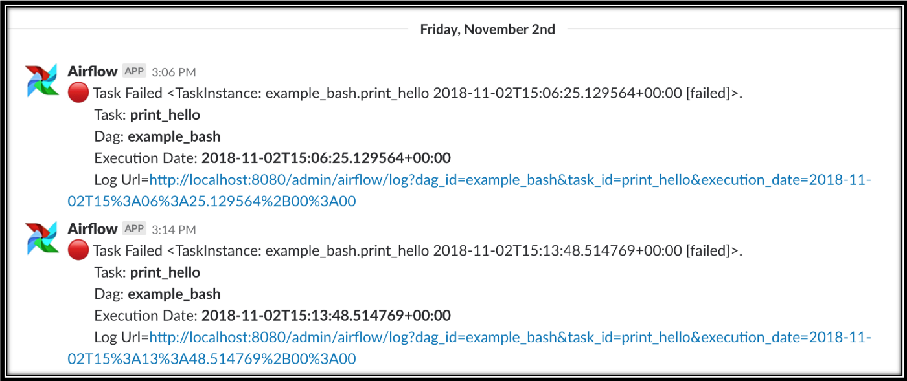

# Alerting

## Alerts

[Monitoring](monitoring.md) and alerting are used together to give a complete picture of the health of our data product.

An alert is triggered by a specific action:
- what cases do you want to alert?
- where should the alert be sent?
- how can you create a useful message?

For example, an actionable alert contains info to help take a follow up action: what, when, and why the pipeline broke (with a link to the error log):

While we may create all kinds of tests and associated alerts, the first ones are usually alerts about the running status of your pipeline. Unfortunately, the outcome of a pipeline is not binary: it could succeed, it could fail, it could be late due to extra data, it could be stuck due to a bug, it could be not started due to a failed dependency, etc. Due to the complexity of the cases, usually you alert failures and [monitor](monitoring.md) (lack of) success.

We could also use alerts as a way to deliver tests. For example, a customer support representative must associate each customer call with a customer. We could test that all tickets have a customer in our production database. If not, we could alert customer support to collect the necessary information.

## Sentry

Using `dlt` [tracing](./tracing.md), you can configure [Sentry](https://sentry.io) DSN to start receiving rich information on executed pipelines, including encountered errors and exceptions.

## Slack & other

Read [here](/docs/running-in-production/running#using-slack-to-send-messages) about how to send messages to slack or how you can read the run status to send messages to other destinations.
